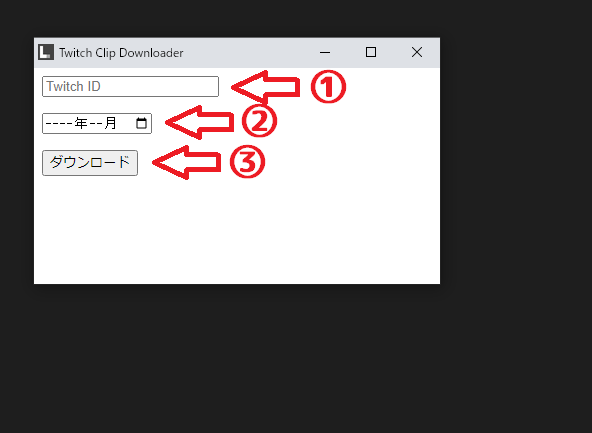

# Twitch Clips Downloader

指定したチャンネルの指定した月のクリップを一括ダウンロードするためのツールです．

## 0. 事前準備

* Python3.8以降をインストール
* TwitchAPIのキーを取得してconfig.jsonに入力

## 1. 環境構築
### 1.1 仮想環境の作成（任意）

```
$ python3 -m venv venv
$ source ./venv/bin/activate # Linux
$ ./venv/Scripts/activate # Windows
```

### 1.2 必要パッケージのインストール

```
$ pip install -U pip
$ pip install -r requirements.txt
```

### 1.3 実行

GUIを起動

```
python main.py
```

<p>①対象とするTwitchチャンネルのIDを入力</p>
<p>②対象とする月を選択</p>
<p>③ダウンロードを実行</p>




### （1.4 バイナリの作成）

```
$ python -m eel main.py web --onefile
```